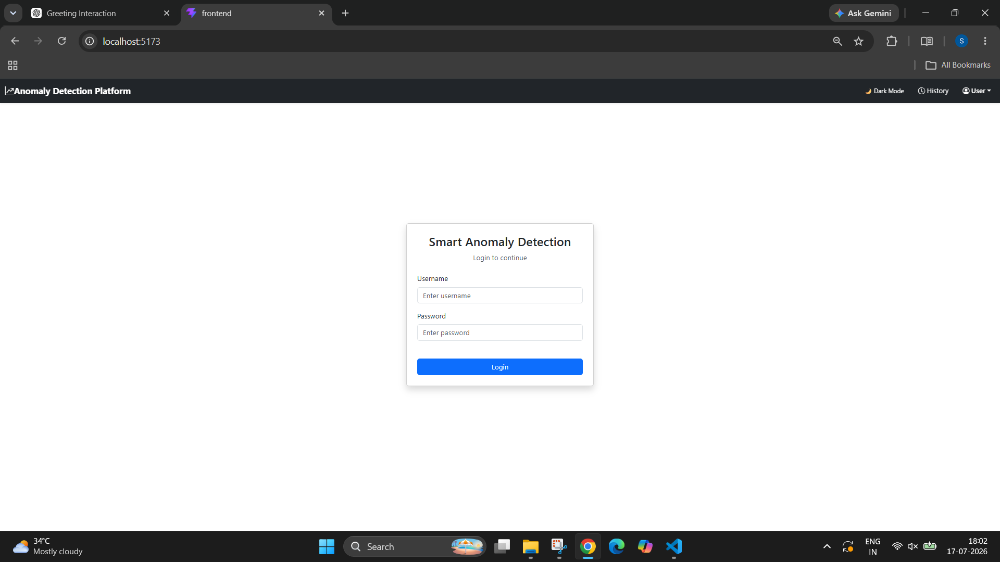
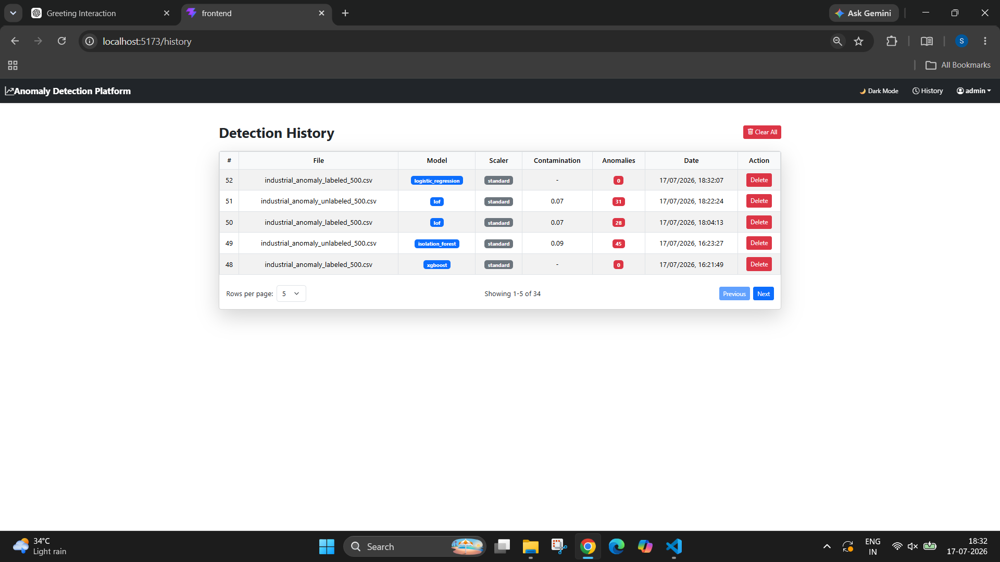

# 🔍 Smart Anomaly Detection & Classification Platform


An end-to-end Machine Learning Analytics Platform that allows users to upload datasets, automatically preprocess them, detect anomalies using multiple unsupervised algorithms, optionally generate pseudo-labels, train supervised classifiers, explain predictions, visualize results, and export professional reports through a modern web interface.

---

# ✨ What This Project Does

The platform provides a complete machine learning workflow instead of just running a single model.

1. Upload a CSV dataset.
2. Validate and preprocess the data.
3. Perform feature engineering and scaling.
4. Detect anomalies using multiple algorithms.
5. Generate pseudo-labels from anomaly predictions.
6. Train classification models when labels are unavailable.
7. Evaluate model performance.
8. Explain predictions using feature importance.
9. Visualize results with PCA and dashboards.
10. Store prediction history and export reports.

---

# 🚀 Features

## Dataset Processing
- CSV upload
- Automatic validation
- Missing value handling
- Numerical feature extraction
- Data preprocessing pipeline

## Anomaly Detection
- Isolation Forest
- Local Outlier Factor (LOF)
- One-Class SVM
- DBSCAN
- Weighted Ensemble

## Classification
- Random Forest
- Decision Tree
- Logistic Regression
- XGBoost

## Explainable AI
- Feature importance
- Human-readable prediction explanations

## Analytics
- Detection statistics
- PCA visualization
- Histograms
- Confusion Matrix
- Performance metrics

## Reports
- PDF export
- CSV export
- Detection history
- Stored model information

## Security
- JWT Authentication
- User-specific data
- Protected REST APIs

---

# 📸 Screenshots

## Login


## Upload Form


## Detection Dashboard


## Classification Dashboard


## History


## Dark Mode


---

# 🧠 Workflow

```text
Dataset
   │
   ▼
Validation
   │
   ▼
Preprocessing
   │
   ▼
Feature Engineering
   │
   ▼
Scaling
   │
   ▼
Anomaly Detection
   │
   ▼
Pseudo Labels
   │
   ▼
Classification
   │
   ▼
Evaluation
   │
   ▼
Explainability
   │
   ▼
Dashboard & Reports
```

---

# 🛠 Technology Stack

### Backend
- Python
- Django
- Django REST Framework

### Frontend
- React
- Vite
- Axios

### Machine Learning
- Scikit-Learn
- XGBoost
- NumPy
- Pandas

### Visualization
- Matplotlib
- PCA

### Reporting
- ReportLab

### Database
- SQLite (Development)
- PostgreSQL Ready

---

# 📁 Project Structure

```text
anomaly/
classification/
accounts/
frontend/
saved_models/
media/
images/
manage.py
requirements.txt
```

---

# ⚙ Installation

```bash
git clone https://github.com/your-username/anomaly-detection-platform.git
cd anomaly-detection-platform

python -m venv venv

# Windows
venv\Scripts\activate

# Linux
source venv/bin/activate

pip install -r requirements.txt

python manage.py migrate
python manage.py createsuperuser
python manage.py runserver
```

---

# 🔮 Future Enhancements

- Docker deployment
- Redis & Celery
- AutoML
- Kubernetes
- Cloud deployment
- Real-time anomaly detection

---

# 👨‍💻 Author

**Sudha Karan**

Python Full Stack Developer | Machine Learning Enthusiast

If you found this project useful, please give it a ⭐ on GitHub.
