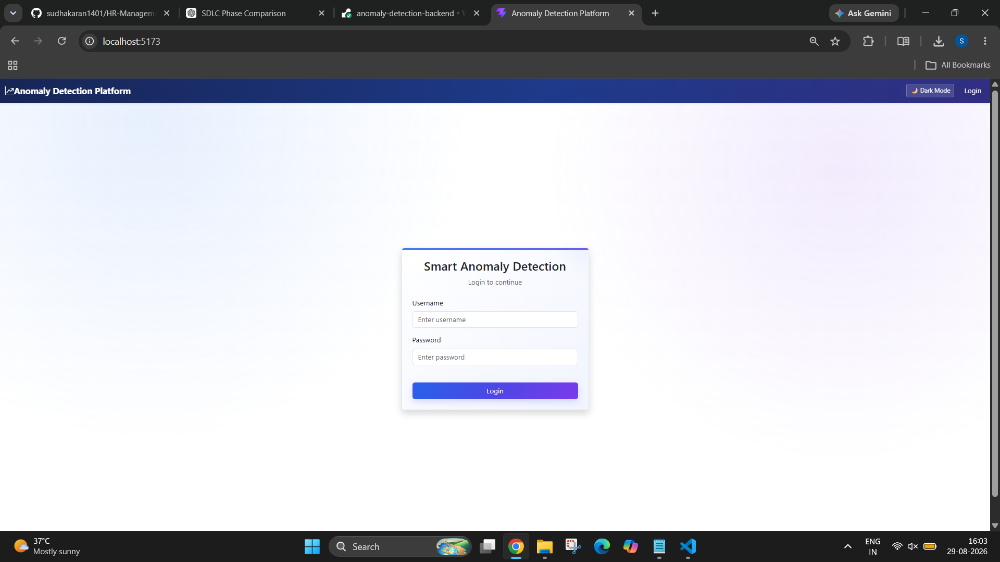
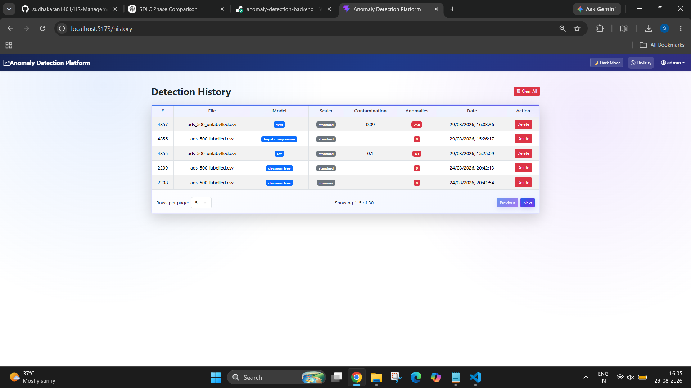

# 🔍 Smart Anomaly Detection & Classification Platform

<p align="center">


</p>

<p align="center">

# An End-to-End Machine Learning Analytics Platform

Upload datasets, detect anomalies, classify data, visualize insights, generate explainable AI predictions, and export professional reports through an intuitive full-stack web application.

Built using **React**, **Django REST Framework**, **Scikit-Learn**, **XGBoost**, and **JWT Authentication**.

</p>

---

# 📖 Overview

The **Smart Anomaly Detection & Classification Platform** is a full-stack Machine Learning Analytics application that enables users to upload structured datasets and perform intelligent anomaly detection through multiple machine learning algorithms.

Unlike conventional ML projects that only execute a single model, this platform provides a complete analytics workflow—from data preprocessing to explainable AI, interactive dashboards, classification, visualization, benchmarking, and automated report generation.

The project combines **React** for the frontend, **Django REST Framework** for backend APIs, and **Scikit-Learn / XGBoost** for machine learning, resulting in a scalable and modular analytics platform.

---

# 🎯 Real-World Applications

The platform can be adapted for several real-world domains:

### 💳 Financial Fraud Detection

Identify suspicious banking or credit card transactions.

### 🌐 Network Intrusion Detection

Detect unusual network activities and cybersecurity threats.

### 🏥 Healthcare Analytics

Identify abnormal patient records or medical measurements.

### 🏭 Manufacturing Quality Control

Detect defective products during production.

### 📡 IoT Monitoring

Identify anomalies in sensor data from smart devices.

### 📈 Business Intelligence

Discover unusual trends and outliers in business datasets.

---

# 🚀 Core Features

## 📂 Dataset Management

- Upload CSV datasets
- Automatic validation
- Missing value handling
- Numerical feature extraction
- Data preprocessing
- Dataset summary
- CSV structure validation
- File-size and filename/path validation

---

## 🧠 Anomaly Detection

Supports multiple anomaly detection algorithms:

- Isolation Forest
- Local Outlier Factor (LOF)
- One-Class SVM
- DBSCAN

A **Weighted Ensemble** workflow is also available through the benchmarking implementation.

---

## 🏷 Classification Module

The platform also supports supervised learning using:

- Random Forest
- Decision Tree
- Logistic Regression
- XGBoost

When labelled data is unavailable, anomaly predictions can be converted into pseudo-labels for supervised learning.

---

## 🔍 Explainable AI (XAI)

Instead of only detecting anomalies, the system explains why predictions were made.

Features include:

- Feature Importance
- Human-readable explanations
- Prediction reasoning

---

## 📊 Analytics Dashboard

Interactive dashboards provide:

- Total Records
- Normal Records
- Anomaly Count
- Detection Percentage
- Average Anomaly Score
- PCA Visualization
- Histograms
- Confusion Matrix
- Classification Metrics

---

## 📑 Reporting

Generate professional reports including:

- PDF Reports
- CSV Export
- Charts
- Statistical Summary
- PCA Visualization

---

## 💾 Model Persistence

The application supports:

- Saving trained models
- Reloading saved models
- Detection history
- User-specific result access

---

## 🔐 Authentication

- JWT Authentication
- User Login
- Protected APIs
- Session Management
- Password Validation

---

# 📸 Application Screenshots

## Login

<p align="center">



</p>

---

## Upload Dataset

<p align="center">


</p>

---

## Detection Dashboard

<p align="center">


</p>

---

## Classification Dashboard

<p align="center">


</p>

---

## Detection History

<p align="center">



</p>

---

## Dark Mode

<p align="center">


</p>

---

# 🧠 Complete Workflow

```text
User Login
      │
      ▼
Upload Dataset
      │
      ▼
Dataset Validation
      │
      ▼
Data Cleaning
      │
      ▼
Feature Engineering
      │
      ▼
Feature Scaling
      │
      ├──────────────────────────┐
      │                          │
      ▼                          ▼
Anomaly Detection          Classification
      │                          │
      ▼                          ▼
Anomaly Evaluation         Classification Evaluation
      │                          │
      └──────────────┬───────────┘
                     ▼
              Explainability
                     │
                     ▼
             PCA Visualization
                     │
                     ▼
             Analytics Dashboard
                     │
                     ▼
              Report Generation
                     │
                     ▼
              Detection History
```

Pseudo-label generation can support the classification workflow when labelled data is unavailable.

---

# 🛠 Technology Stack

## Frontend

- React
- Vite
- Axios
- Bootstrap
- React Router
- Chart.js
- react-chartjs-2
- Bootstrap Icons

## Backend

- Python 3.12+
- Django
- Django REST Framework
- JWT Authentication
- Django CORS Headers

## Machine Learning

- Scikit-Learn
- XGBoost
- Pandas
- NumPy

## Visualization

- Matplotlib
- PCA

## Reporting

- ReportLab

## Database

- SQLite
- PostgreSQL Ready

## Testing

- Django Test Framework
- Vitest
- React Testing Library
- Playwright
- Axe Playwright
- Load Testing
- Stress Testing

## DevOps

- GitHub Actions
- Docker
- Docker Buildx
- GitHub Container Registry
- Vercel
- Render

---

# 📂 Project Structure

The project follows a **full-stack architecture** with separate frontend, backend, benchmarking, and testing modules.

```text
Anomaly_Detection/
│
├── .github/
│   └── workflows/
│
├── backend/
│   ├── accounts/                 # User Authentication & Authorization
│   ├── anomaly/                  # Core anomaly detection module
│   ├── Anomaly_Detection/        # Django project configuration
│   ├── classification/           # Classification module
│   ├── core/                     # Shared utilities & common components
│   ├── media/                    # Uploaded datasets & generated reports
│   ├── saved_models/             # Persisted ML models
│   ├── static/
│   ├── templates/
│   ├── manage.py
│   ├── requirements.txt
│   └── db.sqlite3
│
├── benchmark/                    # Benchmarking and ML evaluation
├── testing/                      # E2E and performance testing
├── docs/                         # Project documentation
│
├── frontend/
│   ├── src/
│   ├── public/
│   ├── images/
│   ├── package.json
│   ├── vite.config.js
│   └── eslint.config.js
│
├── images/                       # README screenshots
├── docker-compose.yml
├── README.md
└── .gitignore
```

---

# 🏗 System Architecture

```text
                         React Frontend
                               │
                               │ Axios
                               ▼
                    Django REST Framework APIs
                               │
                               ▼
                         Service Layer
                               │
              ┌────────────────┼────────────────┐
              ▼                ▼                ▼
      Dataset Processing    ML Pipeline    Report Generator
              │                │                │
              └────────────────┼────────────────┘
                               ▼
                    Scikit-Learn / XGBoost
                               │
                               ▼
                         SQLite Database
```

---

# ⚙️ Installation

## 1. Clone Repository

```bash
git clone https://github.com/sudhakaran1401/Anomaly-Detection-System.git
cd Anomaly_Detection
```

---

## 2. Backend Setup

```bash
cd backend

python -m venv venv
```

### Windows

```bash
venv\Scripts\activate
```

### Linux/macOS

```bash
source venv/bin/activate
```

Install dependencies:

```bash
pip install -r requirements.txt
```

---

## 3. Configure Environment

Create a `.env` file inside the **backend** directory.

Example:

```env
SECRET_KEY=your-secret-key
DEBUG=True
DATABASE_URL=sqlite:///db.sqlite3
```

Do not commit real secrets, database passwords, credentials, or production tokens to Git.

---

## 4. Apply Migrations

```bash
python manage.py makemigrations
python manage.py migrate
```

---

## 5. Create an Admin User

Create a Django superuser:

```bash
python manage.py createsuperuser
```

The Django administration interface is available at:

```text
http://127.0.0.1:8000/admin/
```

---

## 6. Start Backend Server

```bash
python manage.py runserver
```

Backend:

```text
http://127.0.0.1:8000/
```

---

## 7. Frontend Setup

Open another terminal:

```bash
cd frontend
npm install
npm run dev
```

Frontend:

```text
http://localhost:5173
```

The frontend API URL can be configured through:

```env
VITE_API_URL=http://127.0.0.1:8000
```

---

# 🧪 Testing

The project includes backend tests, frontend tests, Playwright end-to-end tests, accessibility checks, and performance testing.

---

## Backend Tests

Backend testing covers:

- Unit tests
- Integration tests
- Security tests
- System-level tests

Run from `backend/`:

```bash
python manage.py test
```

The backend also contains module-level test files inside the individual Django applications.

---

## Frontend Unit & Component Tests

The frontend uses:

- Vitest
- React Testing Library
- Testing Library User Event
- JSDOM

Run:

```bash
cd frontend
npm test
```

Run linting:

```bash
npm run lint
```

Create a production build:

```bash
npm run build
```

---

## End-to-End Tests

The E2E testing project is located in:

```text
testing/
```

Install dependencies:

```bash
cd testing
npm install
```

Install Playwright browsers:

```bash
npx playwright install
```

Run the Playwright test suite:

```bash
npx playwright test
```

The project includes browser-based testing and accessibility checks through Axe Playwright.

---

## Performance Tests

The project includes performance testing for:

- Load testing
- Stress testing

---

# 📚 API Documentation

The Django REST Framework backend provides REST APIs for the application.

Where configured, API documentation is available through Swagger/OpenAPI endpoints.

## Swagger UI

```text
http://127.0.0.1:8000/api/docs/
```

## OpenAPI Schema

```text
http://127.0.0.1:8000/api/schema/
```

---

# 🔌 API Overview

Major API areas include:

```text
/api/
/api/token/
/api/token/refresh/
/api/anomaly/
/api/classification/
/api/dashboard/
/api/history/
/api/reports/
```

The exact endpoints, request bodies, authentication requirements, and response schemas are available through the API documentation.

---

# 🔑 Authentication

JWT authentication is used for protected API access.

## Obtain Token

```http
POST /api/token/
```

## Refresh Token

```http
POST /api/token/refresh/
```

The API uses authenticated access for protected operations and user-specific data.

---

# 🐳 Docker

Docker configuration is provided for running the application services in containers.

## Docker Services

| Service | Purpose |
|---|---|
| Backend | Django REST Framework API |
| Frontend | React/Vite application |
| Database | Application persistence |

## Docker Files

```text
Anomaly_Detection/
│
├── docker-compose.yml
│
├── backend/
│   └── Dockerfile
│
└── frontend/
    └── Dockerfile
```

## Start Docker Compose

From the project root:

```bash
docker compose up --build
```

Run in the background:

```bash
docker compose up --build -d
```

Check running containers:

```bash
docker ps
```

Stop the services:

```bash
docker compose down
```

---

# 🏭 Production Build

## Frontend

Build the React application:

```bash
cd frontend
npm run build
```

Preview the production build locally:

```bash
npm run preview
```

---

## Backend

Run the Django backend using the production configuration provided by the deployment environment.

Production secrets and environment-specific configuration should be supplied through environment variables.

---

# 🌐 Live Deployment

## Frontend

🔗 https://anomaly-detection-system-ruby.vercel.app

The live React application is deployed on **Vercel**.

---

## Backend API

🔗 https://anomaly-detection-backend-5427.onrender.com/

The Django REST Framework backend is deployed on **Render**.

---

## API Documentation

🔗 https://anomaly-detection-backend-5427.onrender.com/api/docs/

Swagger UI provides interactive API documentation.

---

## OpenAPI Schema

🔗 https://anomaly-detection-backend-5427.onrender.com/api/schema/

The OpenAPI schema provides the API specification.

---

# ☁️ Deployment

The production deployment architecture is:

```text
Frontend → Vercel
Backend  → Render
```

The frontend communicates with the Django REST API hosted on Render.

Production secrets, allowed hosts, CORS settings, database configuration, and other sensitive values should be configured through deployment environment variables.

---

# 🔁 CI/CD

The repository contains GitHub Actions workflows for automated project validation, Docker builds, and deployment-related processes.

The deployment architecture is:

```text
GitHub
   │
   ▼
GitHub Actions
   │
   ├── Backend checks/tests
   ├── Frontend checks/tests
   └── Docker CI
           │
           ▼
      Deployment
       │      │
       ▼      ▼
    Vercel  Render
```

Docker images can be built and published through **GitHub Container Registry (GHCR)** where configured by the repository workflows.

---

# 🔒 Security

The backend includes several security-related controls.

## Authentication

- JWT authentication
- Protected API endpoints
- Session management
- Password validation

## Data & Upload Security

- User-specific datasets
- CSV upload validation
- File-size validation
- Filename/path validation

## API Security

- Authenticated REST APIs
- User-specific result access
- CORS configuration
- Protected operations

---

# 🧰 Useful Commands

From `backend/`:

## Check the Project

```bash
python manage.py check
```

## Create Migrations

```bash
python manage.py makemigrations
```

## Apply Migrations

```bash
python manage.py migrate
```

## Create Superuser

```bash
python manage.py createsuperuser
```

## Run Development Server

```bash
python manage.py runserver
```

Frontend:

```bash
cd frontend
npm run lint
npm test
npm run build
```

---

# 🧹 Code Quality

Frontend linting:

```bash
cd frontend
npm run lint
```

Production build:

```bash
npm run build
```

The project also uses automated testing and GitHub Actions workflows for code validation.

---

# 📊 Benchmarking

The project includes a dedicated benchmarking workflow for evaluating anomaly detection models across multiple datasets.

## Benchmark Capabilities

- Model comparison
- Contamination experiments
- Score-threshold experiments
- Repeated runs
- Runtime measurement
- Statistical summaries
- Friedman test
- Pairwise Wilcoxon tests
- Reproducible benchmark runs

## Benchmark Datasets

- Breast Cancer Wisconsin Diagnostic
- UCI Website Phishing
- KDD Cup 1999

---

# 📈 Evaluation Metrics

## Classification

- Accuracy
- Precision
- Recall
- F1 Score
- ROC-AUC

## Anomaly Detection

- Total Anomalies
- Detection Percentage
- Average Anomaly Score
- Specificity
- False Positive Rate
- False Negative Rate
- PCA Visualization
- Confusion Matrix

---

# 🗃️ Sample Data & Test Data

The project includes datasets and benchmark configurations used for development, testing, and machine learning evaluation.

Benchmark datasets include:

- Breast Cancer Wisconsin Diagnostic
- UCI Website Phishing
- KDD Cup 1999

---

# 🛠️ Troubleshooting

## Frontend Cannot Connect to Backend

Check that:

- The backend is running.
- The frontend API URL points to the correct backend.
- CORS allows the frontend origin.

For local development:

```env
VITE_API_URL=http://127.0.0.1:8000
```

---

## CORS Error

Verify that the backend CORS configuration includes the frontend origin being used.

---

## Dataset Upload Error

Verify that:

- The uploaded file is CSV.
- The file size is within the configured limit.
- Dataset columns are valid.
- The filename/path is valid.

---

## Migration Error

Run:

```bash
python manage.py makemigrations
python manage.py migrate
```

Then restart the backend server.

---

# 🚀 Typical Development Workflow

```text
1. Clone repository
        │
        ▼
2. Configure backend/.env
        │
        ▼
3. Install backend dependencies
        │
        ▼
4. Apply migrations
        │
        ▼
5. Create superuser / test data
        │
        ▼
6. Start Django backend
        │
        ▼
7. Install frontend dependencies
        │
        ▼
8. Start React/Vite frontend
        │
        ▼
9. Upload and validate dataset
        │
        ▼
10. Run anomaly detection / classification
        │
        ▼
11. Review analytics and reports
        │
        ▼
12. Run tests
        │
        ▼
13. Push to GitHub
        │
        ▼
14. GitHub Actions runs CI/CD
```

---

# 📌 Important URLs

## Local Development

| Resource | URL |
|---|---|
| Frontend | `http://localhost:5173` |
| Backend | `http://127.0.0.1:8000` |
| Django Admin | `http://127.0.0.1:8000/admin/` |
| API Documentation | `http://127.0.0.1:8000/api/docs/` |
| OpenAPI Schema | `http://127.0.0.1:8000/api/schema/` |

## Production

| Resource | URL |
|---|---|
| Frontend | `https://anomaly-detection-system-ruby.vercel.app` |
| Backend | `https://anomaly-detection-backend-5427.onrender.com/` |
| API Documentation | `https://anomaly-detection-backend-5427.onrender.com/api/docs/` |
| OpenAPI Schema | `https://anomaly-detection-backend-5427.onrender.com/api/schema/` |

---

# 📋 Project Modules

| Module | Responsibility |
|---|---|
| `accounts` | Authentication and user-related functionality |
| `anomaly` | Dataset processing and anomaly detection |
| `classification` | Supervised classification workflows |
| `core` | Shared utilities and common functionality |
| `benchmark` | Model benchmarking and statistical evaluation |
| `frontend` | React interface, dashboards and user interaction |
| `testing` | End-to-end and performance testing |

---

# 📈 Future Enhancements

Possible future improvements include:

- PostgreSQL Production Database
- Redis Caching
- Celery Background Tasks
- AutoML Integration
- Kubernetes Deployment
- Cloud Deployment (AWS / Azure)
- Real-time Streaming Analytics
- Model Monitoring Dashboard

---

# 🤝 Contributing

Contributions are welcome.

## Suggested Workflow

Create a feature branch:

```bash
git checkout -b feature/your-feature
```

Run the relevant backend tests:

```bash
cd backend
python manage.py check
python manage.py test
```

Run frontend checks:

```bash
cd ../frontend
npm run lint
npm test
npm run build
```

For E2E changes:

```bash
cd ../testing
npx playwright test
```

Commit your changes:

```bash
git add .
git commit -m "Add your change"
```

Push the branch:

```bash
git push origin feature/your-feature
```

Then open a pull request.

---

# 📄 License

This project is licensed under the **MIT License**.

See the repository license file for the complete license terms.

---

# 👨‍💻 Author

## Sudhakaran

**Python Full Stack Developer | Machine Learning Enthusiast**

GitHub:

https://github.com/sudhakaran1401

---

# ⭐ Support

If you find this project useful, consider giving the repository a ⭐ on GitHub.

It helps support future development and makes the repository more discoverable.
